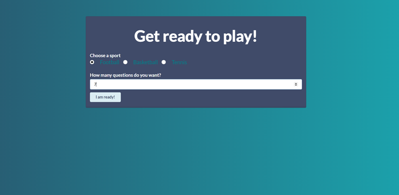

## Django Sports Quiz Game 
### Introduction
This app is a sports quiz game. My goal for the project was to build a fun website with the new technologies that I learnt(python, Django, Ajax) and practice diffrent queries.

You can play the quiz by choosing a specific sport category and the number of questions you'd like. Registered users can add new questions, edit them and delete them. Also the quiz score is saved for the registered users.

The website is built using Python/Django for the backend with SQLite3 database and styled with semantic UI.
 

## Getting Started
### Running Locally
Clone the repository with `git clone https://github.com/MaryamWeb/Sports-Quiz.git` or download it. 

make sure you are in the correct directory.

## Installing Dependencies
Make sure you have Python3 [python docs](https://docs.python.org/3/using/unix.html#getting-and-installing-the-latest-version-of-python) 
Django 

### Virtual Enviornment
It is recomended to create a virtual environment [python docs](https://packaging.python.org/guides/installing-using-pip-and-virtual-environments/)

### Creating a virtual environment:
`py -m venv ENV_NAME`

### Activate the virtual environment:
`call ENV_NAME\Scripts\activate` 

### PIP Dependencies
In the terminal run `pip install -r requirements.txt` This will install all of the required packages.

### Run database migrations
`python manage.py migrate`

## Running Your app locally
Make sure you are in the correct directory then activate your virtual enviornment   --> `call env_sportsquiz\Scripts\activate`

run `python manage.py runserver 7000`

to view in the browser open `http://localhost:7000/`

## Project Screen Shot:

